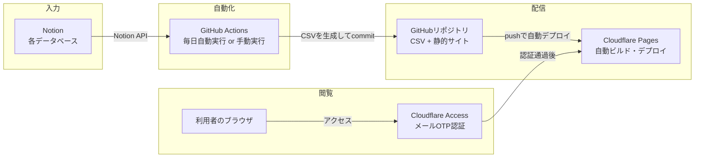

# 仕様書：社会情報インフラ部 第1ライン ダッシュボード

このドキュメントは「このダッシュボードがどういう仕組みで動いているか」をまとめたものです。技術的な詳細は最小限にとどめ、全体像を把握できることを目的としています。

関連ドキュメント：[ユーザーマニュアル](./user_manual.md)｜[管理マニュアル](./admin_manual.md)

---

## 1. これは何か

社会情報インフラ部 第1ライン（9名）向けの社内情報共有ダッシュボードです。KPI（3SEレポート提出状況・売上）、インフォメーション、メンバー一覧、ナレッジ・FAQ、会議計画、スキルマップなどを1箇所にまとめています。

- 対象期間：FY2027（2026年8月〜2027年7月）
- 公開URL：https://team-dashboard-fy2027.pages.dev
- 閲覧には認証が必要（詳細は5章）

## 2. 全体構成

データの入力元はNotion、表示側はGitHub上の静的サイトという2層構成です。特別なサーバーやデータベースは持ちません。

**ポイント**
- Notionが「唯一のデータ入力場所」。ダッシュボード側には直接データを入力する画面はない
- サイト自体はビルドツールを使わない素のHTML/CSS/JavaScript。フレームワーク・サーバーサイド処理なし
- GitHubへのpushをトリガーにCloudflare Pagesが自動でビルド・公開する

## 3. 技術スタック

| 項目 | 採用技術 |
|------|---------|
| ページ | 素のHTML / CSS / JavaScript（フレームワークなし） |
| グラフ描画 | Chart.js 4.4.1 |
| CSV読み込み | PapaParse 5.4.1 |
| ホスティング | Cloudflare Pages（無料枠） |
| ソース管理・自動化 | GitHub / GitHub Actions |
| データ管理 | Notion（各種データベース） |
| 認証 | Cloudflare Access（Zero Trust、無料枠50名まで） |

外部サービスへの依存は上記のみで、月額固定費は基本的に発生しません（Notion・GitHub・Cloudflareいずれも無料枠内で運用）。

## 4. ページ構成

| ページ | 内容 |
|--------|------|
| トップ | KPIサマリー＋直近のインフォメーション最大5件 |
| インフォメーション | お知らせ全件＋期限切れのアーカイブ |
| メンバー | 第1ライン・第1-1ラインの名簿（写真・役職・等級など） |
| 3SEレポート | 月別レポート提出状況の集計・グラフ |
| 売上・数字 | 予算vs実績、顧客別の月次推移 |
| ナレッジ・FAQ | 社内ルール・手順のQ&A、技術記事 |
| ライン別会議実施計画 | 会議の方針と月別実施予定 |
| スキルマップ | メンバー×スキルのマトリクス、レーダーチャート、資格一覧 |

このほかに、管理者（課長）専用でメニューには出てこない「メンテナンス切替アプリ」というページが1つ存在します（詳細は管理マニュアル参照）。

## 5. データが更新される仕組み

1. 課長・管理者がNotion上の各データベースを編集する
2. GitHub Actionsが（自動または手動で）Notion APIから最新データを取得し、CSVファイルを再生成する
3. 変更があれば自動的にGitHubへコミット・pushされる
4. pushをきっかけにCloudflare Pagesが自動で再ビルド・公開する

このため、**ダッシュボードのコードを直接触らなくても、Notionを更新するだけで表示内容が変わります**。自動同期は1日1回に加えて、必要なタイミングで手動実行も可能です。

## 6. 認証の仕組み（概要）

サイト全体（データファイルも含む）にCloudflare Accessという仕組みで認証をかけています。

- 利用者は会社のメールアドレスを入力し、届いたワンタイムコード（OTP）でログインする
- 許可されているメールアドレス（会社ドメイン＋個別に許可した数名）以外はアクセスできない
- 一度ログインすれば約1ヶ月は再ログイン不要
- パスワードやIDを共有する運用ではないため、個人単位で「誰がアクセスできるか」を管理できる

過去（〜2026年8月上旬）は共通ID・PASSによるBasic認証でしたが、個人単位の管理に切り替えました。設定変更の手順は管理マニュアルにまとめています。

## 7. メンテナンスモード

データ更新中やトラブル時に、サイト全体を「メンテナンス中」画面に切り替える機能があります。管理者がスマホアプリ風の専用ページからワンタップで切替できます。詳細は管理マニュアル参照。

## 8. この仕組みを他部署等でも作りたい場合

同じ仕組みを作るために最低限必要なもの：

- GitHubアカウント（リポジトリ管理・GitHub Actions実行）
- Cloudflareアカウント（Pages・Access、いずれも無料枠で足りる規模）
- Notionアカウント・ワークスペース（データ管理用）
- HTML/CSS/JavaScriptの基本的な実装（生成AIを使えばゼロから書く必要はない）

サーバーの契約や月額費用は不要で、社内向け・少人数（〜数十名）規模の情報共有ダッシュボードであれば同様の構成で低コストに構築できます。
